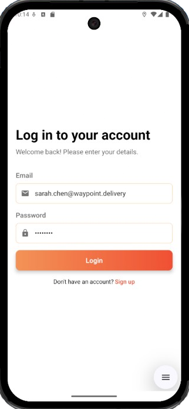
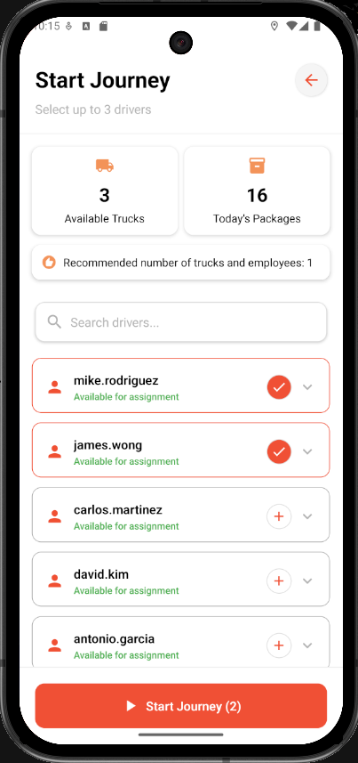
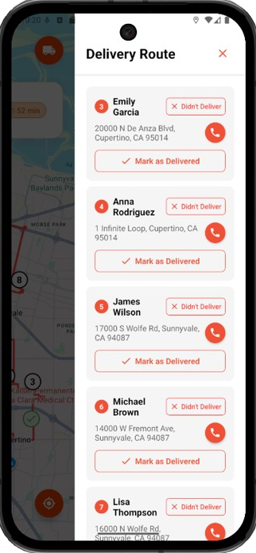
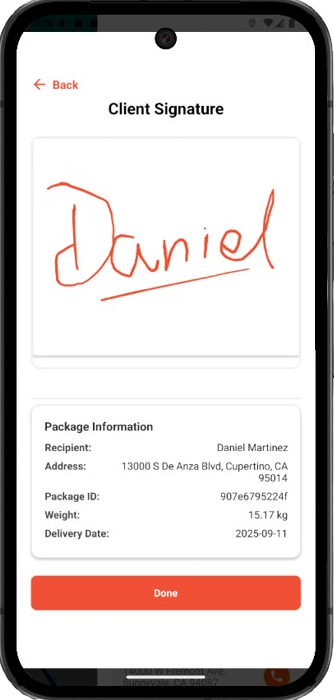
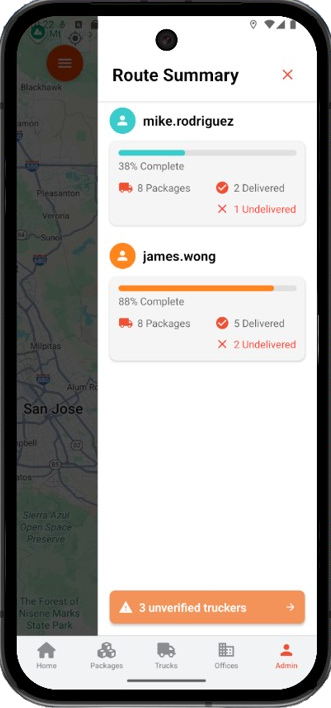
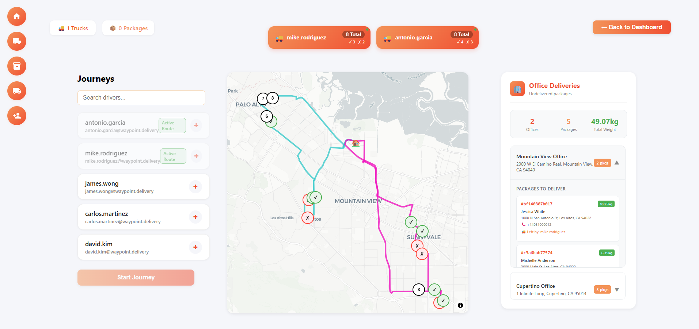
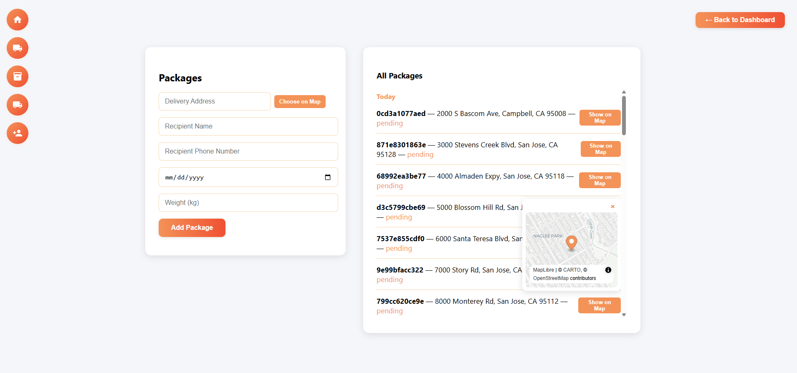

# Waypoint - Smart Logistics Management System

**Save Time, Cut Costs, Deliver Smart.**

Waypoint plans daily delivery routes for a company's trucks. A manager adds packages and trucks and picks which drivers work today. Waypoint then clusters the day's packages into one zone per driver, matches each zone to a truck with enough capacity, and orders the stops into an optimised round trip. Truckers follow their route in the app, collect a signature at each drop-off, and hand anything they couldn't deliver to the nearest company office.

## ✨ Features

- 📦 **Packages and trucks.** Add packages (address, recipient, weight, delivery date) and trucks (capacity). Each company sees only its own data.
- 🧭 **Route planning.** Today's and overdue packages are split into one zone per selected driver using K-means clustering. Each zone gets the smallest free truck that can carry it, and the stops are ordered with [OSRM](https://project-osrm.org/).
- 🚚 **Trucker app.** Shows the route on a map in visiting order. The trucker marks each package delivered, with the recipient's signature, or not delivered. The route is recalculated if they go off course.
- 🏢 **Office drop-off.** Undelivered packages are assigned to the nearest company office and routed there at the end of the day.
- 🗺️ **Manager map.** Shows every active route with per-driver progress. An API for live truck positions is available for the app to use.
- 📊 **Dashboard and history.** Package, truck and driver statistics, plus a daily delivery history.
- ✉️ **Email notifications.** Recipients are emailed on delivery or office drop-off, once SMTP is configured (see [server/README.md](server/README.md)).
- 🔐 **Roles.** JWT authentication with separate manager and trucker roles. Truckers join a company with its company ID and are verified by the manager.

## 📷 Screenshots

| Login | Start journey | Delivery route | Signature | Route summary |
|:---:|:---:|:---:|:---:|:---:|
|  |  |  |  |  |

**Manager: journeys map**



**Manager: packages**



## 🗂️ Repository layout

| Path | Contents |
|---|---|
| [`server/`](server/) | Django REST API: authentication, packages, trucks, routing, history, statistics and live positions. |
| [`Client/`](Client/) | The original React Native (Expo) client. It is being replaced by a Flutter app that lives in its own repository. |
| [`images/`](images/) | Screenshots used in this README. |

## 🛠️ Getting started

Prerequisites: [Docker](https://docs.docker.com/get-docker/) with Docker Compose.

```bash
git clone https://github.com/SectorCT/WayPoint.git
cd WayPoint/server
docker compose up -d --build
docker compose exec web python manage.py all   # wipe the database and load demo data
```

The API runs at `http://localhost:8000/v1/`. No configuration is needed for local development. Everything is optional and set through `server/.env` (template: [`server/.env.example`](server/.env.example)).

Demo accounts (password `radiradi` for all):

| Role | Email |
|---|---|
| Manager | `sarah.chen@waypoint.delivery` |
| Truckers | `mike.rodriguez@`, `james.wong@`, `carlos.martinez@`, `david.kim@`, `antonio.garcia@` (all `@waypoint.delivery`) |

The demo company ID for registering new truckers is `SFLOGISTICS2024`. Only `mike.rodriguez` and `james.wong` start out verified.

Point a client at `http://localhost:8000` (from an Android emulator, use `http://10.0.2.2:8000`).

[server/README.md](server/README.md) covers the rest:
- configuration (time zone, CORS, secrets)
- running the tests
- the permission model
- email setup
- running your own OSRM routing server instead of the public demo server

## 🏗️ Tech stack

- **Backend:** Python 3.10, Django 5.2, Django REST Framework, Simple JWT
- **Database:** PostgreSQL 16
- **Routing:** OSRM (public demo server by default, self-hostable via Docker), scikit-learn K-means for zoning
- **Clients:** Flutter (current); React Native / Expo (legacy, in `Client/`)
- **Maps:** OpenStreetMap data

## 📜 License

This project is licensed under the MIT License. See the [LICENSE](LICENSE) file for details.

## 🤝 Contributing

We welcome contributions! To contribute:
1. Fork the repository
2. Create a feature branch (`git checkout -b feature-branch`)
3. Commit your changes (`git commit -m 'Add new feature'`)
4. Push to your branch (`git push origin feature-branch`)
5. Create a Pull Request

Please run the backend tests before opening a PR: `docker compose exec web python manage.py test`.

## 📞 Contact & Support

For support, suggestions, or feedback, please contact:
- Email: contact@sectorct.com
- Website: sectorct.com (coming soon)

---
🚀 **Waypoint - Revolutionizing Logistics, One Delivery at a Time!**
